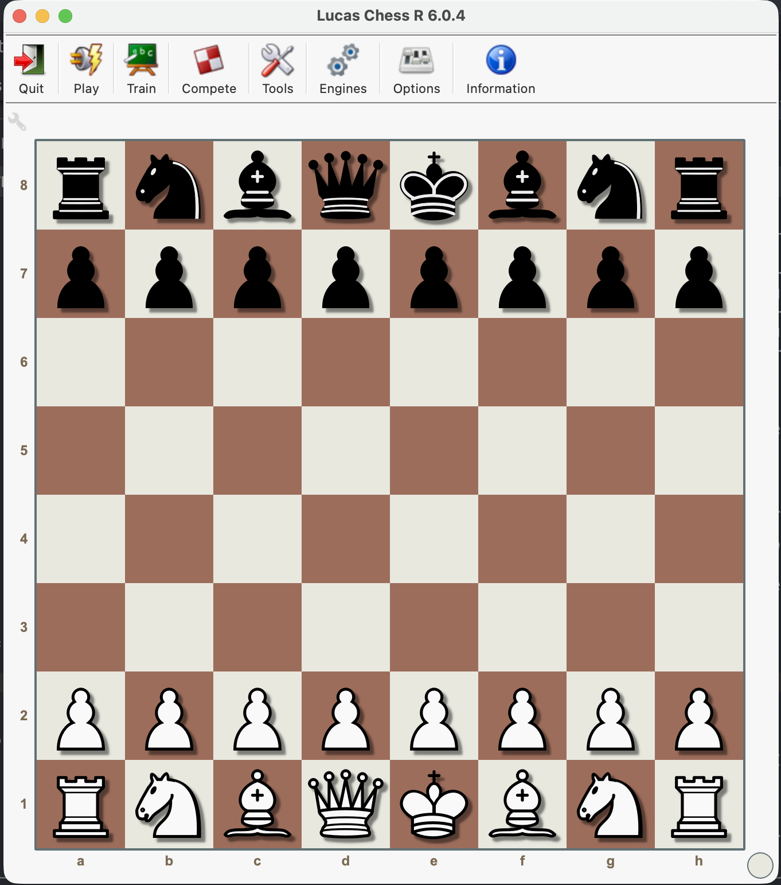

Lucas Chess (R6)
================

> **This branch adds macOS (Apple Silicon) support.** It is a fork of
> [lukasmonk/lucaschessR6](https://github.com/lukasmonk/lucaschessR6); everything below is
> the upstream readme. The app runs natively on macOS/arm64, with FasterCode and 18 of the
> bundled engines (including Stockfish 18 and Irina) compiled from the `src.7z` archives
> already in the repository. Build instructions, the list of what does and does not compile,
> and the verification suite are in
> [`bin/OS/darwin/README.md`](bin/OS/darwin/README.md).
>
> **Ready to run, no Python or compiler needed:**
> [download the disk image](https://bolzano.at/chess/mac/) (276 MB, macOS 12+ on Apple
> silicon). Drag it onto Applications; the first launch needs right-click > Open, because
> the build is not notarized.
>
> To build it from source instead:
>
>     brew install git-lfs sevenzip && git lfs install
>     git clone --branch macos-arm64 https://github.com/jbh4x82/lucaschessR6.git
>     cd lucaschessR6
>     python3.12 -m venv .venv && .venv/bin/pip install -r requirements.txt cython
>     bin/_fastercode/fastercode_macos.sh
>     python3 bin/OS/darwin/build_engines.py
>     ./LucasChess.command

<p align="center">
  
  <br>
  <em>R 6.0.4 running natively on macOS 26.5, Apple Silicon</em>
</p>

Lucas Chess (R6) is a GUI of chess:

1. To train in many different ways.
2. To play chess against any UCI engine.
3. To compete against engines to obtain an elo.
4. It has utilities to edit games, create polyglot books, tournaments between engines ...

This is an update of Lucas Chess with a new version of python (3.7 -> 3.12) and the main graphic library, from pyside2 to pyside6 (qt5 -> qt6).


Incompatibilities
-----------------
* **Does not support Windows 8 or previous versions.**
* **Not compatible with 32-bit operating systems.**

Dependencies
------------

* Python 3.12+
* charset-normalizer
* sortedcontainers
* python-chess
* pillow
* psutil
* polib
* deep-translator
* requests
* urllib3
* idna
* certifi
* beautifulsoup4

Important Note for Developers / Cloning
---------------------------------------

This repository uses **Git LFS (Large File Storage)** to manage large binary files (such as chess engines, networks, or databases).

If you download the repository using the GitHub web interface as a **.zip file, these large files will not be included correctly** (you will only get small text pointer files).

To get a complete and working copy of the project, please ensure you have **Git LFS** installed on your system before cloning.

1. **Install Git LFS** (if you haven't already):
   - Windows: `winget install GitHub.GitLFS` or download from [git-lfs.github.com](https://git-lfs.github.com/)
   - Mac: `brew install git-lfs`
   - Linux: `sudo apt install git-lfs`

2. **Initialize Git LFS** in your terminal:
   ```bash
   git lfs install

3. Clone the repository:
   ```bash
   git clone https://github.com/lukasmonk/lucaschessR6.git

Links
-----

* Web: [https://lucaschess.pythonanywhere.com/](https://lucaschess.pythonanywhere.com/).
* Blog: [https://lucaschess.blogspot.com.es/](https://lucaschess.blogspot.com.es/).


Legal Details
-------------

This program is free software; you can redistribute it and/or modify
it under the terms of the GNU General Public License as published by
the Free Software Foundation; either version 2 of the License, or (at
your option) any later version.

This program is distributed in the hope that it will be useful, but
WITHOUT ANY WARRANTY; without even the implied warranty of
MERCHANTABILITY or FITNESS FOR A PARTICULAR PURPOSE.  See the GNU
General Public License for more details.

You should have received a copy of the GNU General Public License
along with this program; if not, write to the Free Software
Foundation, Inc., 59 Temple Place, Suite 330, Boston, MA 02111-1307
USA

See the file "LICENSE" for details.


